# Session 1

# <a name="editor">Working with the Unity Editor

## General Unity Glossary

### Unity Hub
The Installer for different Unity versions and the place to open all of your Unity projects 

### Unity Editor 
The Unity programm itself, where you design your game 

### Build 
when you are finished with your game, you can export your game as a build, which means that the game can be played on different platforms without the Unity Editor. 

### Project 
The project consists of all the elements that make up your game, it is a folder on your harddrive. 

### Scenes 
Scenes are like levels in your game, each level usually is made out of one scene. In the scene you basically save how your Assets are linked to each other (how they are placed in the scene, how they interact etc.). You can have as many scenes as you like in your game and not every scene has to be in the final game. 

### Assets 
Assets are all Elements in Unity that are saved as a file on your computer. For example 3D-Objects, Materials, Scripts etc. 

### GameObjects
GameObjects are the virtual objects in your Unity Scene, they are not saved as a file in your assets folder, but they only exist within the scene. (If you want to create an Assets out of a GameObject you can create a PreFab.) 

### Component 
Components are the functional pieces of every GameObject. Each GameObject is made out of different components, e.g. the "Mesh Renderer" tells Unity that this is an object that should be rendered (should be visible) in the scene. 

## Unity Editor User Interface

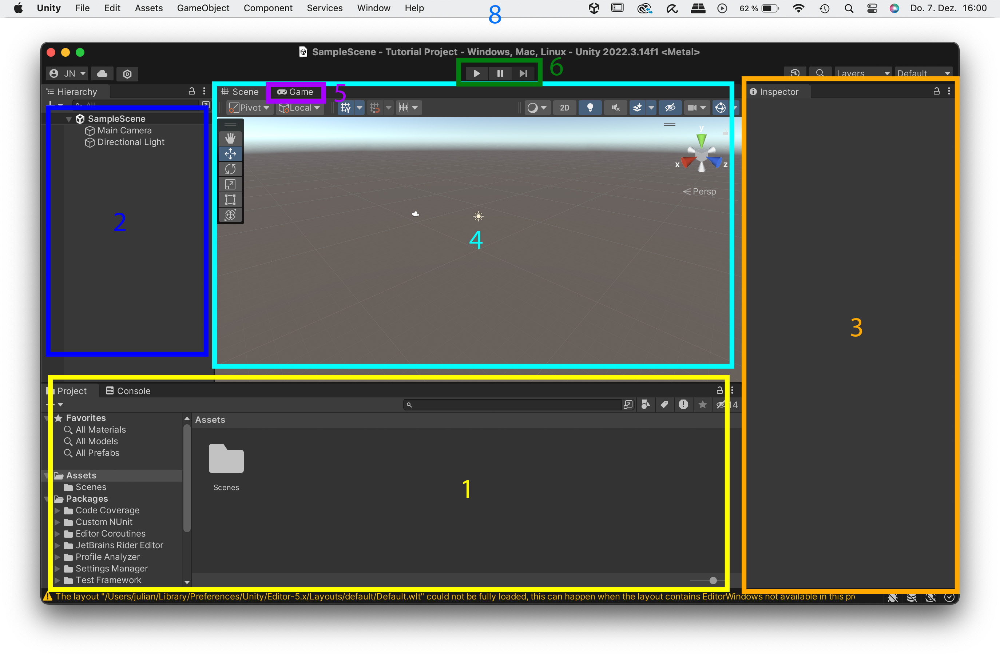

### 1. Project windows: 
- a file explorer, where you can find all of your assets 
- Unity projects are always a folder consisting of different file types (in contrast to e.g. a Blender file). That means if you press save, you only save the current scene, the rest of your project in saved in the folder. 

> Data backups: always duplicate the entire folder, ideally always copy the entire folder before making major changes. Alternatively: Use a version control system like git. 

### 2. Hierarchy
- In the Hierarchy you can find all the GameObjects that are in your currently opened scene
- Here you can also see how the objects are arranged hierarchically (Parent-Child)

### 3. Inspector
- shows you all the Components that are part of the current GameObject when you select a GameObject
- also shows you the properties of all the Assets when you select an Assets
- allows you to change the properties of the different Components & Assets

### 4. Scene View 

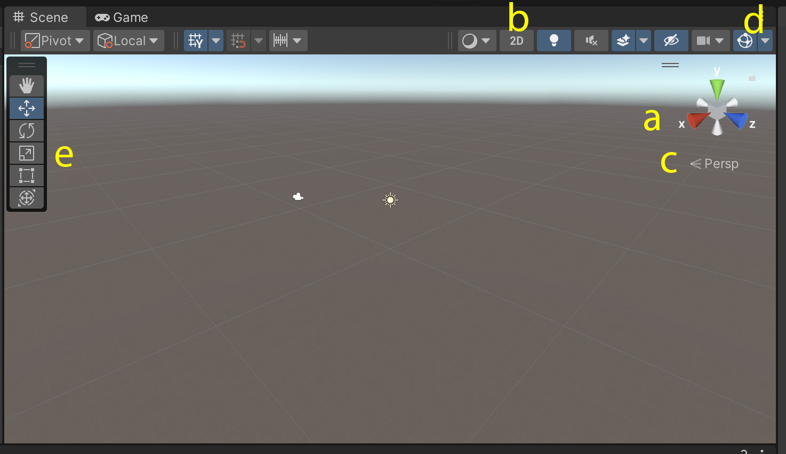

- Displays the current 3D scene
- Move with: 
	- Rotate: option + mouse click
	- Move: option + command + mouse click
	- Zoom: Two finger scroll 
	- double-click on object: focus on object 
- Use the Scene Gizmo (a) to switch to a single axis view 
- You can switch between 2D & 3D view (b) (helpful for UI work)
- You can change the perspective mode (c)
- Toggle visibily of gizmos (d)
- Tools to move/rotate/scale objects (e)

### 5. Game View 
- shows the game as it will look later when the player will play it
- if you press "Play" at the top of the screen, a preview of how the game will look later is displayed here 
- here you can preview the game in different screen sizes etc. 
- most of the animations/scripts etc. only run when you have pressed play

### 6. Toolbar 
- Control the Game Mode of the current scene

### 7. Menubar
- can be used to create Assets, GameObjects, change the window-arrangement, save the current scene etc. 

You can find a Cheat Sheet with the Basic Unity UI Elements here: 
https://github.com/juliannetzer/arfoundation-demos_khb_sose22/blob/master/Handouts/220501_UnityCheatsheet.pdf

## Further tutorials for getting started in Unity: 
- [Everest Pipkin: Quickstart Unity 3d ](https://docs.google.com/document/d/1xwGpjgIRhZAqprW-jECGN1WNh_o2jfO_84hjLQ59TIQ/edit)
- [Brackeys: How to make a Video Game - Getting Started](https://www.youtube.com/watch?v=j48LtUkZRjU&list=PLPV2KyIb3jR5QFsefuO2RlAgWEz6EvVi6)
- [Ray Wenderlich: Unity Getting started](https://www.kodeco.com/7514-introduction-to-unity-getting-started-part-1-2)
- [The Ultimate Beginner Guide to Unity](https://www.freecodecamp.org/news/the-ultimate-beginners-guide-to-game-development-in-unity-f9bfe972c2b5/)

#  How to structure your unity projects

A well-structured Unity project is essential for maintaining organization, efficiency, and scalability. As projects grow, managing assets, scenes, and scripts becomes increasingly complex. Proper folder organization helps prevent clutter and makes collaboration easier.

Key best practices include:
## Organizing assets into folders 
You can use folders in the Project Window to organize your assets. To create a new folder, right-click inside the Project Window and select Create -> Folder.

Here is an example of a recommended folder structure: 
Assets/
│── Animations/         # Animator controllers & animation clips  
│── Audio/              # Sound effects, background music  
│── Materials/          # Materials and shaders  
│── Models/             # Imported 3D models  
│── Textures/           # Images for materials and UI  

## Using clear names
Using consistent names helps avoid confusion and ensures files and GameObjects are easy to locate.

## Organizing GameObjects
In Unity, you can use Empty GameObjects to organize objects in your scene, similar to how folders help structure files in the Project Window. This improves hierarchy management and makes it easier to navigate large scenes.

How to Create an Empty GameObject:
- In the Hierarchy Window, right-click and select Create Empty (or use GameObject → Create Empty from the menu).
- Rename it to reflect its purpose (e.g., "Environment", "UI Elements", "Enemies").
- Drag related GameObjects under the empty GameObject to group them together.

> When you group GameObjects under an Empty GameObject, you can move and scale them all at once by adjusting the parent object. This makes it easier to manage and reposition groups of objects within your scene.

[Best practices of organizing your unity project](https://unity.com/how-to/organizing-your-project)

#  Basic 3D Objects

Unity has a few builtin basic 3D Models, like Cubes, Planes, etc. 

You can find them under GameObject -> 3D Object

> You can also use these simple 3D Objects to build complex scenes, for example when using quads as surfaces and then apply a texture to it you can build simple 2.5D-worlds like [here](https://vk-showcase.kh-berlin.de/project/whomans).

#  Materials/ Shaders/ Textures 

Every 3D-Assets in Unity needs a material that is attached to it, and every material needs a shader. The material is the place where the information like colors and textures are stored. The shader then tells unity how to render these information. (you can compare it to using a pencil: the material stores the color, the shader stores whether it is a wax crayon or a colored pencil). 

Most materials have a certain set of textures (images) applied. The most important ones in Unity are: 

- Albedo/Base Map: The main color texture that defines the basic surface appearance and color of a material. It represents how the surface looks under pure white light without any lighting effects.
- Specular Map: Controls the shininess and highlight intensity across different parts of the surface. Bright areas in the map appear more reflective/shiny, while dark areas appear more matte.
- Normal Map: Adds detailed surface bumps and wrinkles without requiring extra geometry. It stores surface angle deviations in RGB channels, creating the illusion of intricate surface detail through light interaction.
- Height Map: Creates parallax effects by simulating surface depth. Lighter areas appear raised while darker areas appear sunken, adding depth perception when viewing the surface at angles.
- Occlusion Map: Represents how much ambient light reaches different parts of the surface. Dark areas receive less ambient light, enhancing the perception of crevices and adding depth to surface details.

## Create a new material: 

Click on Assets -> Create -> Material

Now you can add some textures and change the colors. 
To apply the material to an object, just drag and drop it onto the object. 

## Shaders 
Shaders are small programs that determine how objects appear in a 3D scene by controlling how surfaces interact with light and textures. They are used to define visual effects like colors, reflections, transparency, and more. Unity uses shaders to create realistic or stylized materials, enabling a wide range of visual styles for your projects. 

The most important ones for you are: 
- Lit: The standard shader with all the standard settings, is affected by your scene lighing
- Unlit: Minimal shader, that is not effected by lighting. 

You can find the shaders by clicking on: 
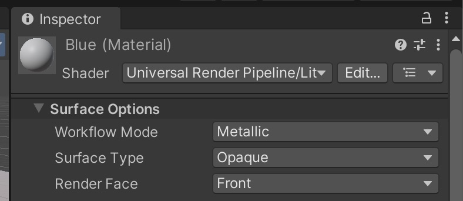
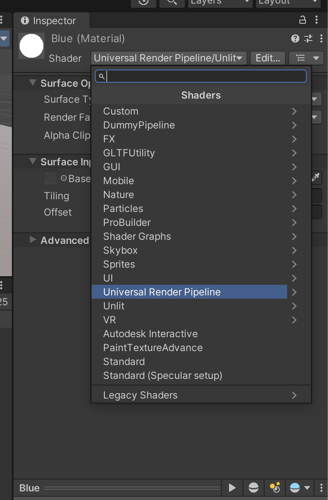
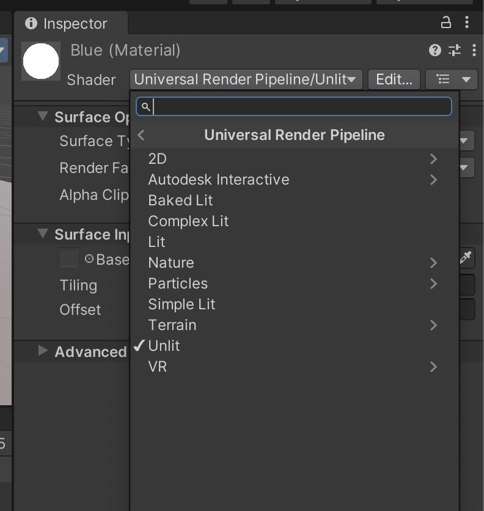

## Working with Transparency
To work with transparency you can either select a shaders that directly supports transcparency (e.g. Unlit -> Transparency) or you can change the render setting of your shader, in case of the Lit shader like this: 
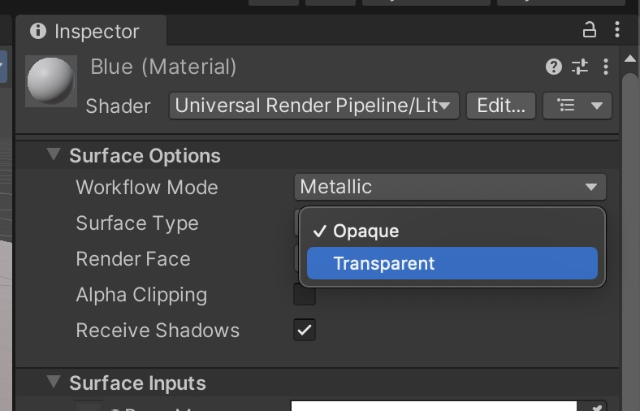

Also make sure to change the Transparency-Setting when importing your texture/image (see also in "Checking the Import settings")
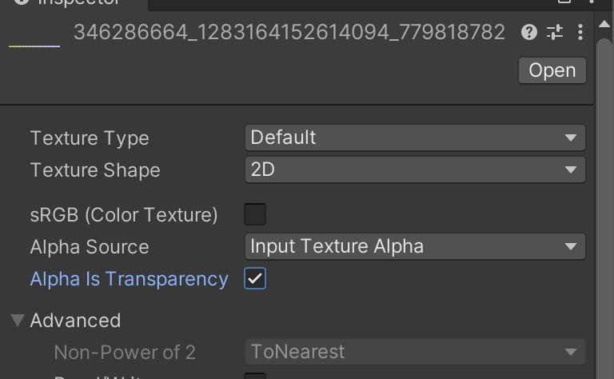

## Textures

## Places to get free Textures: 
- [Polyhaven](https://polyhaven.com/textures)
- [Unity Asset Store](https://assetstore.unity.com/?category=2d%2Ftextures-materials&free=true&orderBy=1)
- [AmbientCG](https://ambientcg.com/)

### Settings for Polyhaven: 

- Resolution: 2K (or on better machine, or complex textures 4K)
- ZIP 
- .JPGs (or for better quality .PNG)

Conversion Table for using Polyhaven Materials: 
| Unity            | Polyhaven   |
| ---------------- | ----------- |
| Albedo/ Base Map | Diffuse     |
| Specular Map     | Spec        |
| Normal Map       | Normal (GL) |
| Height Map       | Displacement|
| Occlusion Map    | AO          |

## Checking the Import settings

1. Select the file
In the Project window, click once on the imported file (for example a texture or a 3D model).

2. Look at the Inspector
On the right side of the Unity interface, you will see the Inspector.
This panel shows the Import Settings of the selected file.
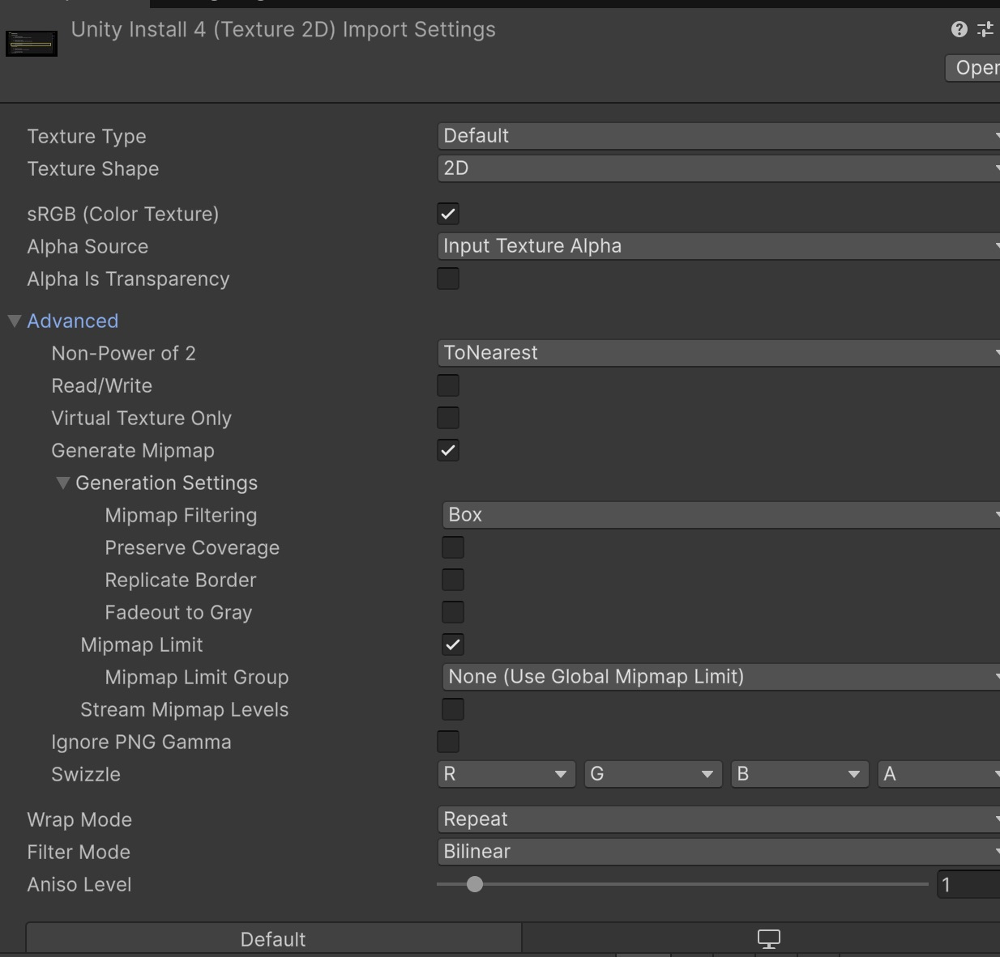

3. Check the important options: 

- Alpha is Transparency turned on, when you work with transparency
- When you don't work with square images: Advanced -> Non-Power of 2 -> None
> Square textures (for example 512×512 or 1024×1024 pixels) work best in Unity because they are more efficient for real-time rendering. Unity and graphics hardware are optimized for these sizes, which helps improve performance and avoids technical issues. However, non-square textures can also be used if needed.

4. Apply changes
If you change any setting, always click Apply at the bottom of the Inspector.
Otherwise, Unity will not update the file.

## Importing your own textures into Unity

1. Prepare the texture
Create your texture in an external tool such as Photoshop, GIMP, or Substance Painter.
It is recommended to use a square texture (e.g. 512×512, 1024×1024, 2048×2048 pixels), as this works best with real-time rendering and performance.
Save the file as PNG or JPG (PNG is recommended for transparency).

2. Import into Unity
Drag the image file into the Assets folder of your Unity project.
Unity will automatically import the texture.

3. Check the import settings
Select the texture in the Project window and adjust the settings in the Inspector (Texture Type, Max Size, Compression), then click Apply.

4. Create or assign a material
Create a Material and drag the texture into the Albedo / Base Map slot.

5. Apply to an object
Drag the material onto a 3D object in the Scene or Hierarchy to see the texture in real time.

# Lighting the Scene
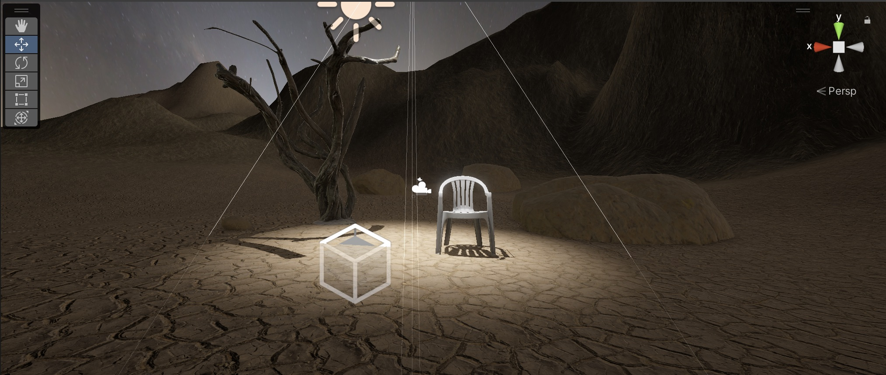

## Realtime Lights 
Realtime lights calculate the lightrays in realtime, that means you can move the lights, move the object that catch shadows from the light without any prerendering. 

You can find them under GameObjects -> Light
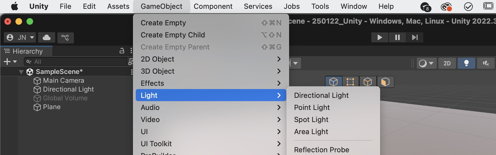

There are three types of lights: Spotlight, Pointlight, Directional light. 

#### Spotlight
A Spotlight emits light in a cone shape, illuminating only a specific area in a particular direction. It's ideal for focused lighting, like flashlights, spotlights on a stage, or headlights on a vehicle. You can adjust the cone angle and range to control its spread.

#### Point Light
A Point Light emits light uniformly in all directions from a single point, similar to a light bulb. It's perfect for creating localized illumination, such as a lamp, a torch, or glowing orbs. You can adjust its range to control how far the light reaches.

#### Directional Light
A Directional Light emits light evenly across the entire scene, simulating sunlight or moonlight. It has no specific source position and affects all objects as though light rays are parallel. It's commonly used for outdoor scenes or large-scale environments.

You can also change parameters like intensity, color etc. when you select the light in your scene or in your hierarchy: 
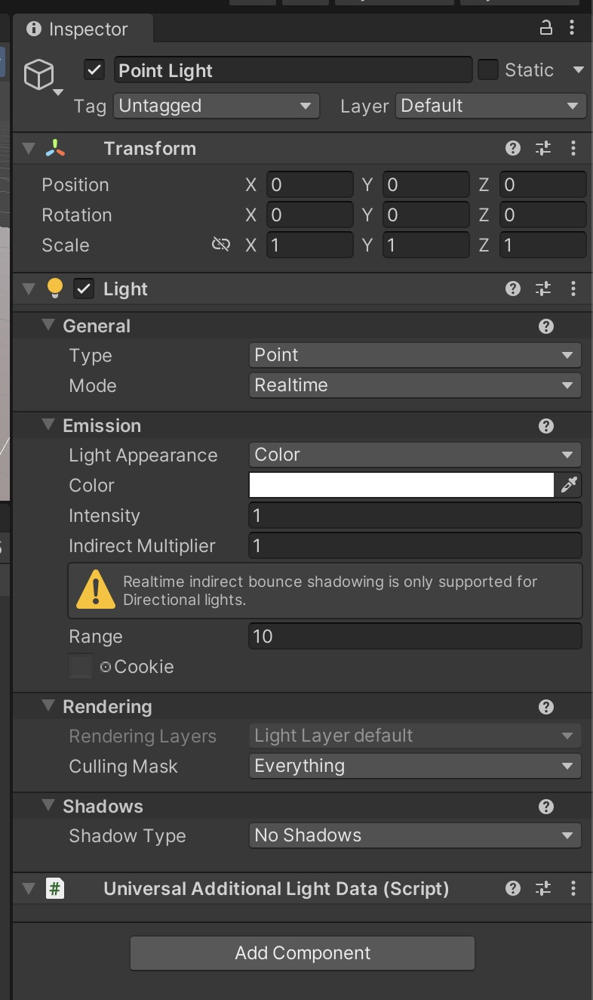

## <a name="workingtogether">Working together with Unity 

To work together in Unity you can either work from on file (e.g. on an external drive) or you can split the work: Person 1 works on the world, Person 2 on the models/materials etc. 

To merge project the easiest way is to work in one main project and then create packages to transfer your Objects or files. 

## Creating your package for sharing

To create your own package go to Assets -> Export Package 
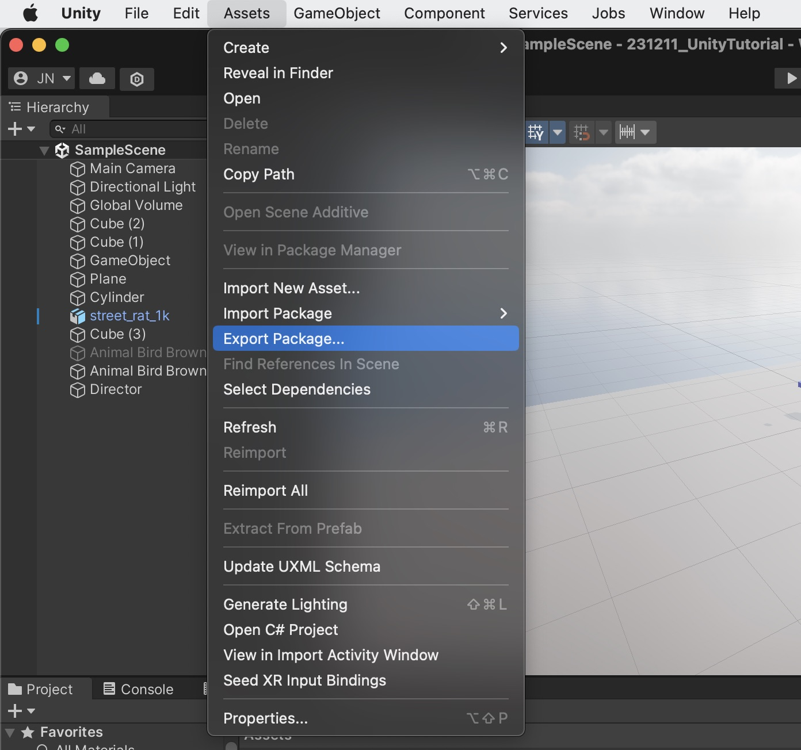

Then you can select the Assets that you want to include.
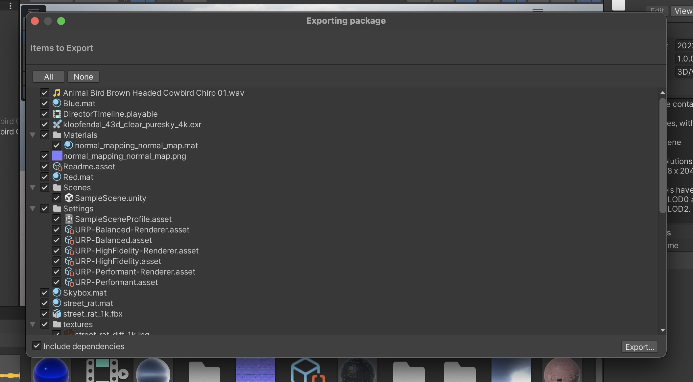
If you now click on Export it will export your files as .unitypackage-file. 

If you want to include Assets from only one scene you can first select your scene in the Project window, right click on it and click on "Select dependencies": 
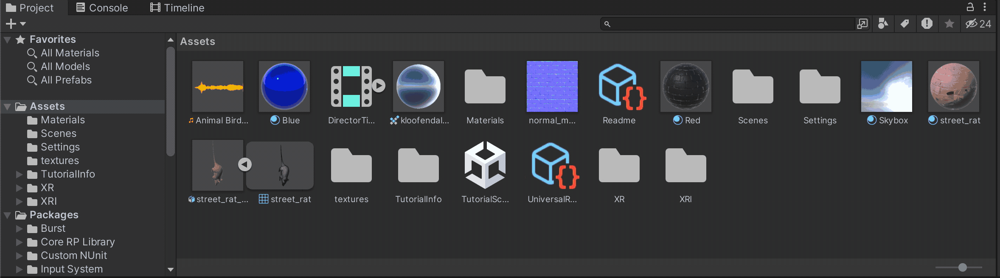
When you now click on Assets -> "Export Package" Unity will only include the Assets from the scene that you selected. 

## Importing costum packages
To import a package (like the one you created earlier) click on Assets -> Import Package -> Costum Package
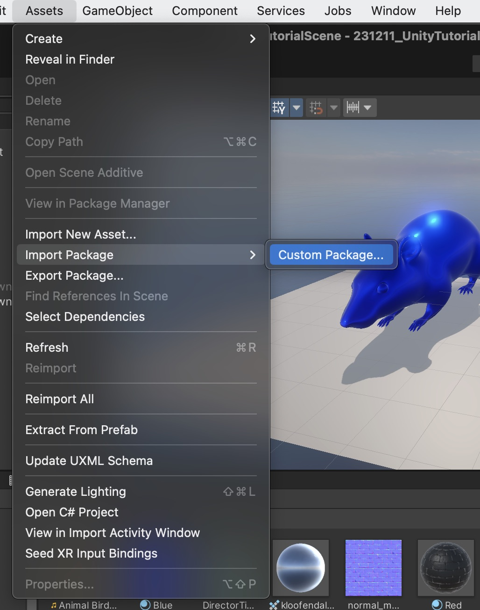

