Before we start: [Download the Example Assets](https://juliannetzer.de/downloads/AssetsSRH2.zip)

#  Working with imported 3D Assets
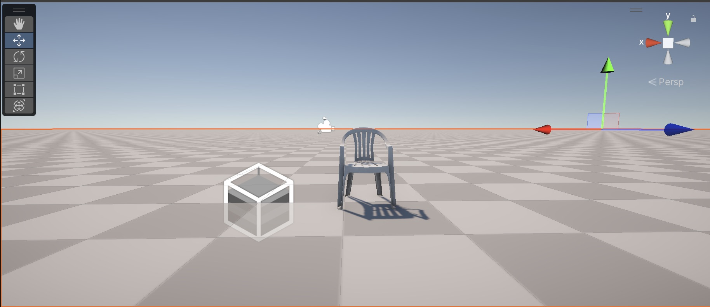

Most of the times the 3D-Assets are generated outside of Unity and then imported into the project.

To import Assets into your project, just drag and drop them into the "project"/Assets-window

Supported file formats: 
- .fbx (usually works best) 
- .obj 
- .dae
- .3ds
- .dxf

Note: you can also use other file formats (link .blend etc. if the corresponding software is installed but i wouldn't recommend it) 

[Unity Documentation on file formats](https://docs.unity3d.com/2020.1/Documentation/Manual/3D-formats.html)

## Best places to get free 3D-Assets 

- [Sketchfab](https://sketchfab.com): Large library for free Assets, also from museums etc., mixed quality & licenses 
- [Mixamo](https://www.mixamo.com/): Large library of (mostly) humanoid Avatars & Animations
- [Everything Library](https://everythingcanvas.vercel.app/): Models from the Everything Game. Right click to download and you need to install additional things, see below. 
- [Polyhaven](https://polyhaven.com/models): Not that many models, but all can be used for any purpose (commercial and personal)
- [NASA 3D Models](https://nasa3d.arc.nasa.gov/models): library of space related objects, different quality, but some are quiet nice
- [Three D Scans](https://threedscans.com/): library of 3d scanned statues & some animals, very detailed 
- [ArtStation](https://www.artstation.com/marketplace/game-dev/assets?section=free): Plattform, mixed quality, different
- [Quaternius](https://quaternius.com/): nice low poly packs, most of them free to use
- [OpenGameArt](https://opengameart.org/art-search-advanced?keys=&field_art_type_tid%5B%5D=10&sort_by=count&sort_order=DESC): a lot, mixed quality
- [Dimensiva](https://dimensiva.com/free-3d-models/): mostly furniture
- [Unity Asset Store](https://assetstore.unity.com/?category=3d%2Fenvironments&free=true&orderBy=1): Large library of assets, specifically for unity, sometimes with animations 

> Trees are rather difficult to render in Unity, so either use Low-Poly Versions, or you can also find some in the Assets Store (e.g. [Realistic Pines](https://assetstore.unity.com/packages/3d/vegetation/trees/realistic-pine-tree-pack-232166), [Polygon Trees](https://assetstore.unity.com/packages/3d/vegetation/trees/polygon-trees-224068))

### Using Everything Models 

1. Install glb-Plugin: 
Go to https://github.com/Siccity/GLTFUtility and click on "Code" -> "Download ZIP"
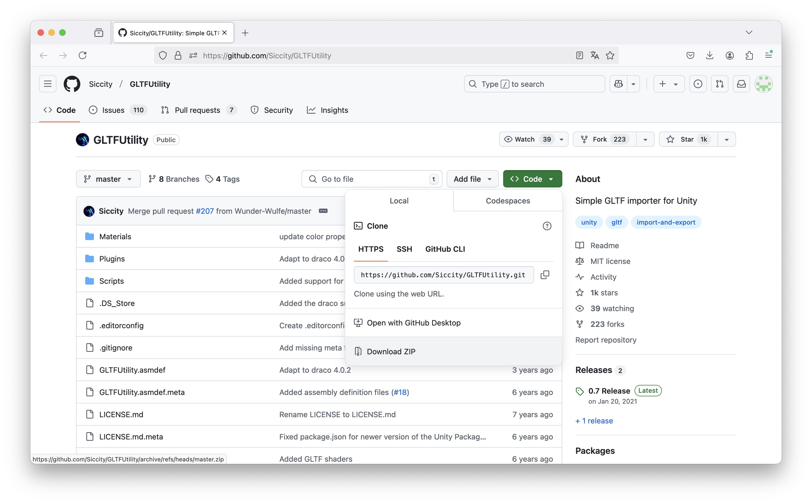

Then extract and .zip-file and go back to Unity. Click on "Window" -> "Package Manager"
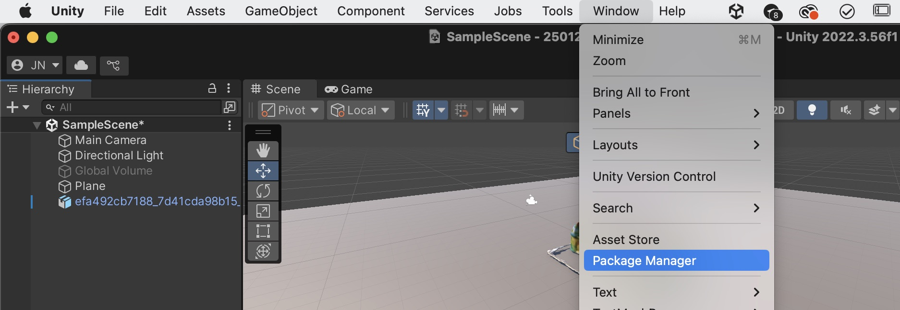

Click on the + and select "Add package from disk"
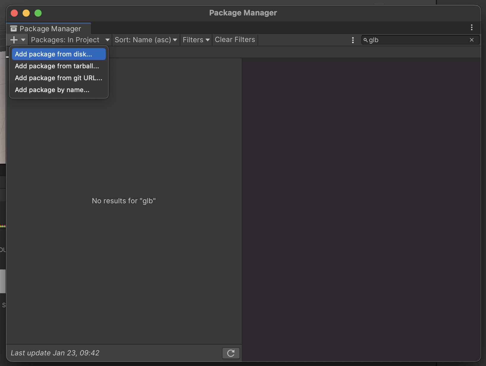

Then find your extracted .zip-file and open the "package.json"-file. 
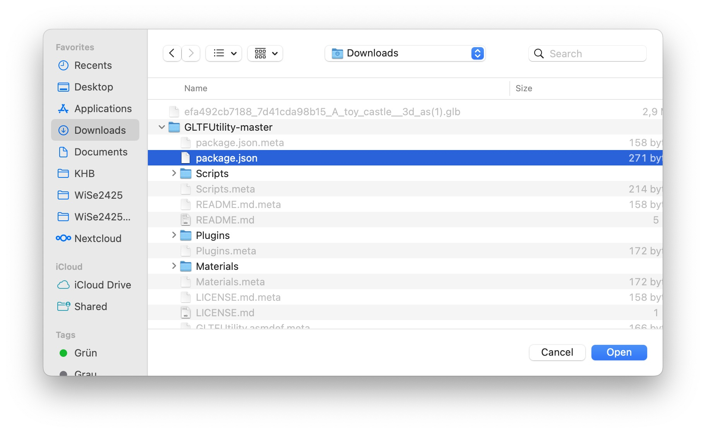

2. Download the Vertex Lit Shader 
- download this shader: [VertexLitShader](Assets/VertexColorLit.shader) (go to "Download Raw File")
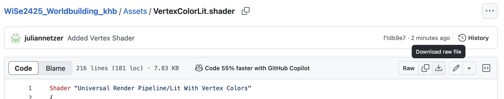
- Drag and Drop the shader in your Unity Project Window
- Create a new material -> Drag and Drop the shader on this Material
- Apply this material to the everything Model in your scene 

##   Online Sculpting Tools

### SculptGL 
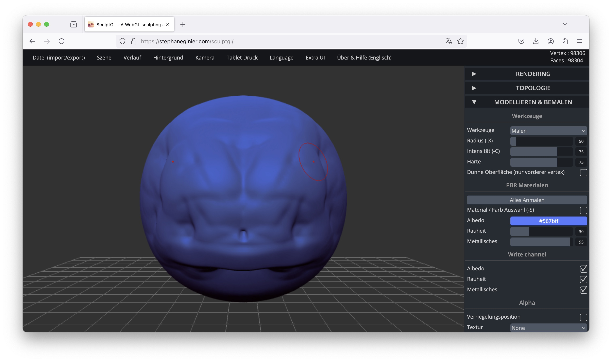

An  WebGL-based sculpting application that enables users to create and refine 3D models directly in their browser.
[Link](https://stephaneginier.com/sculptgl/)

When using this tool, please set the resolution to 3: 
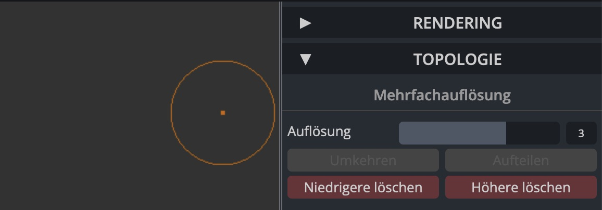

### MonsterMash
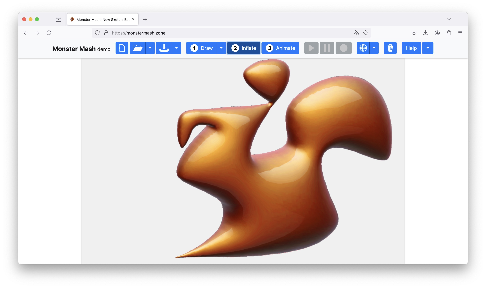
A sketch-based modeling and animation tool that allows users to draw 2D characters, inflate them into 3D models, and animate them.
[Link](https://monstermash.zone/)

## AI Tools

### Hyper3D 
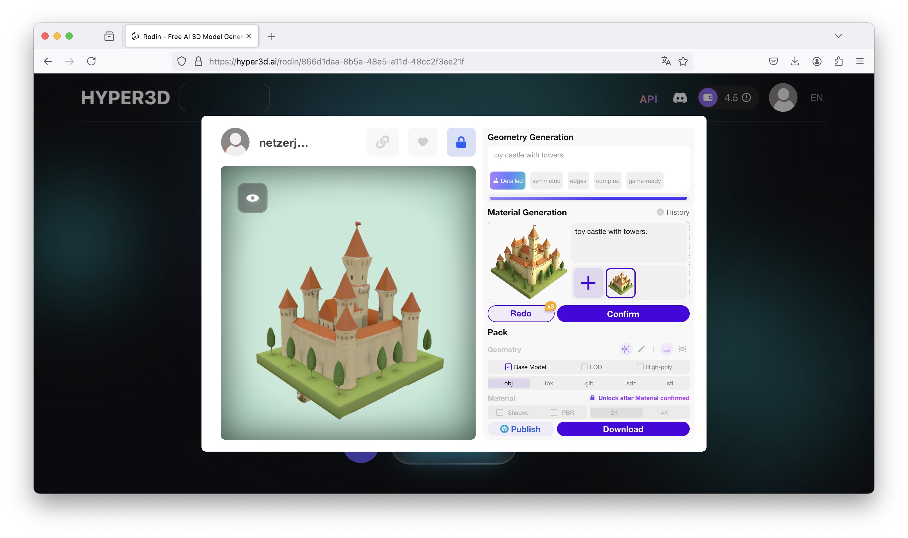
An AI-powered 3D model generator that creates 3D assets from text and images.
- [Hyper3D - Rodin](https://hyper3d.ai/)

> Note: You can only download models created with V1.5! 

## Troubleshooting

### Material is displayed pink: 
Probably a problem with the renderpipeline, find the material in the project window, select it and then click on "Edit -> Rendering -> Materials -> Convert Selected Built-in Materials to URP". If this does not work, either create a new material and assign it, or if you can get the asset in a different fileformat try that. 

### Imported object does not have a color/texture 
- See whether the asset comes with a "material" or "texture" folder, if yes, try: 
	- select the 3D-model in the project window, and go to the "Materials"-Tab in the Inspector window, select Location -> Use External Materials (Legacy) and click "Apply"
	- If this does not work: switch to Location -> Use Embedded Materials again and click on "Extract Materials" and then on "Apply". This extract the Materials from the model and you can manually assign the textures/colors etc. 
- If it does not come with an extra folder: 
	- select the asset in the Project window and click on "Extract Textures" and/or "Extract Materials" in the Inspector (in the "Materials" Tab)
	-  If there are still no materials/textures you have to manually create them/ or find a new asset

## 3D Scanning/ Photogrammetry

- [Polycam](https://apps.apple.com/de/app/polycam-lidar-3d-scanner/id1532482376)
- [Luma AI](https://apps.apple.com/de/app/luma-3d-capture/id1615849914)

> Note: Often 3D scanned models are very detailed and Unity can't handle the data very well. To make sure that Unity can handle the models, you can decimate your 3D-Models in the 3D-Software Blender, you can find a Tutorial here: https://www.youtube.com/watch?v=N4QY-1Vf6LM 

# Performance?

Especially when choosing the 3D assets and lights, you should have in mind where your scene will be played in the end, e.g. as desktop VR, i.e. on a powerful computer, or in mobile VR (e.g. an Oculus Quest). As all devices only have a limited performance capacity.

To reduce the triangles of an object, you can use a 3D-modelling-software like blender, you can find more information here: 
[Simplify a Mesh in Blender](https://all3dp.com/2/blender-simplify-mesh-simply-explained/)

# Terrain Tool  
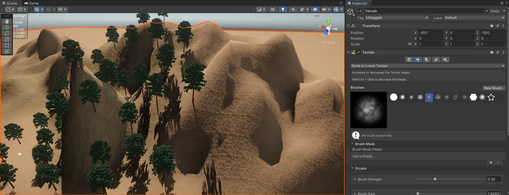
With the Terrain Tool, you can very easily create landscapes and add vegetation. 

To create a Terrain go to: GameObject -> 3D Object -> Terrain 

To now change the height of the Terrain select the Terrain and select the Raise or Lower Terrain Brush: 
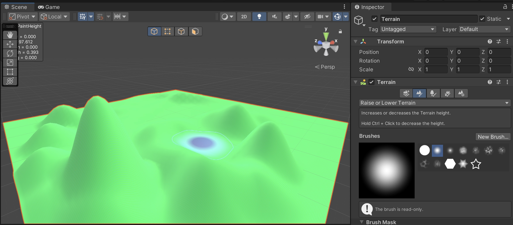

To Paint a Texture select the "Paint Texture" Brush: 
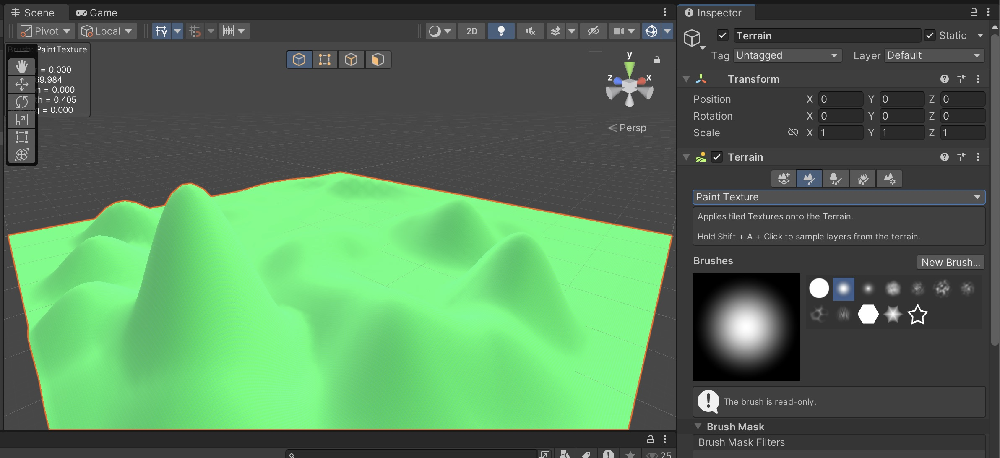
Then create a new Layer and choose a texture:  
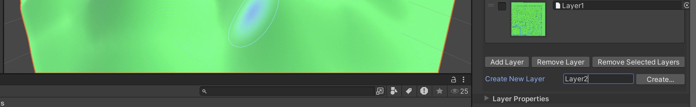
And select with which Layer you want to draw: 
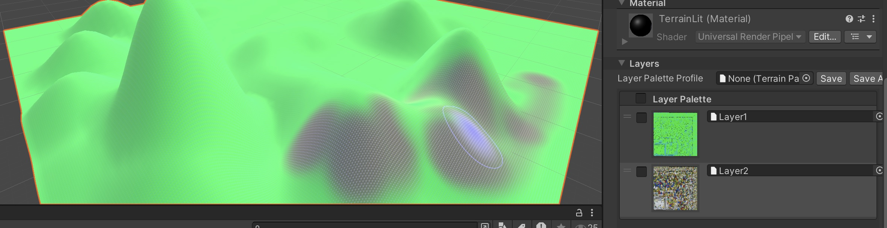

You can find a good tutorial here: 
[How to build beautiful landscapes in Unity using Terrain Tools | Tutorial](https://www.youtube.com/watch?v=smnLYvF40s4)

# Camera & The Game Window

## Camera
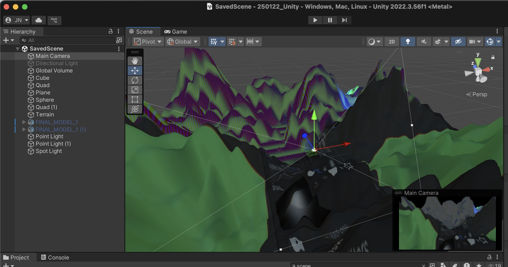
The Camera in Unity acts as the player’s view into the game world, rendering everything it sees. It defines what is visible on screen, including perspective, depth, and field of view. Every Unity scene starts with a Main Camera, which you can find in the Hierarchy panel. You can adjust its properties in the Inspector, such as position, projection type (perspective or orthographic). In the scene view you can also see the cameras view frustum and a small preview of what the camera sees. 
When you are in the scene view you can right click on the camera and choose "Align to View", this aligns the camera to your current scene view.

## Game View
The Game View window in Unity shows how your game will look when played. It renders what the Main Camera sees and simulates the final player experience. You can test gameplay, adjust resolutions, and switch between different aspect ratios. The Play, Pause, and Step buttons allow you to run and debug your game in real time. Unlike the Scene View, which is for editing, the Game View provides a preview of the final visuals and interactions. 
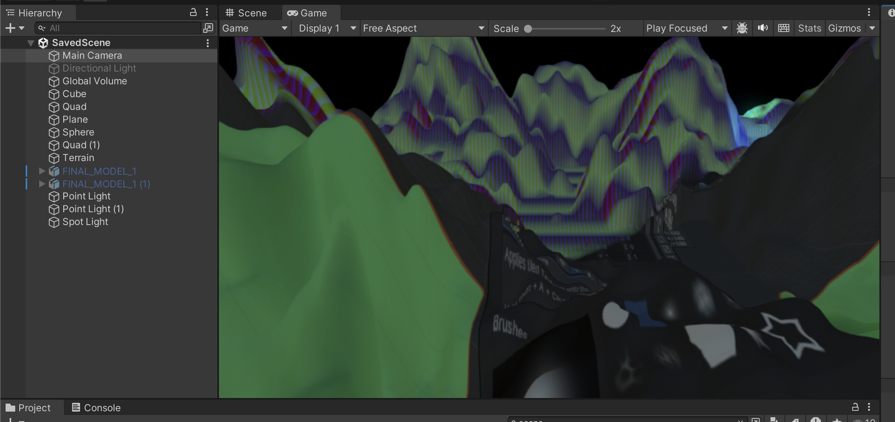

When we work with Animations and Audio you can only see and hear the effect with the game running, to do this, click the Play-Button on top of the window: 
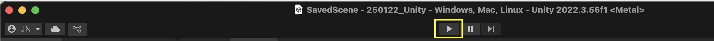

> !!! Changes made in Play Mode are not saved, so be sure to stop the game by clicking the Play button again before making any adjustments. !!! 

# Visual Effects & Global Volume

The Global Volume in Unity is a component that applies post-processing effects across the entire scene. You can adjust settings like exposure and color adjustments in a Volume Profile to control the overall look of your game. Since it affects the whole scene, it’s useful for setting up consistent visual aesthetics. 

To change the settings select "Global Volume" in your hiearchy, in the inspector you can see the different settings. If you click on "Add Override" you can add effects. 
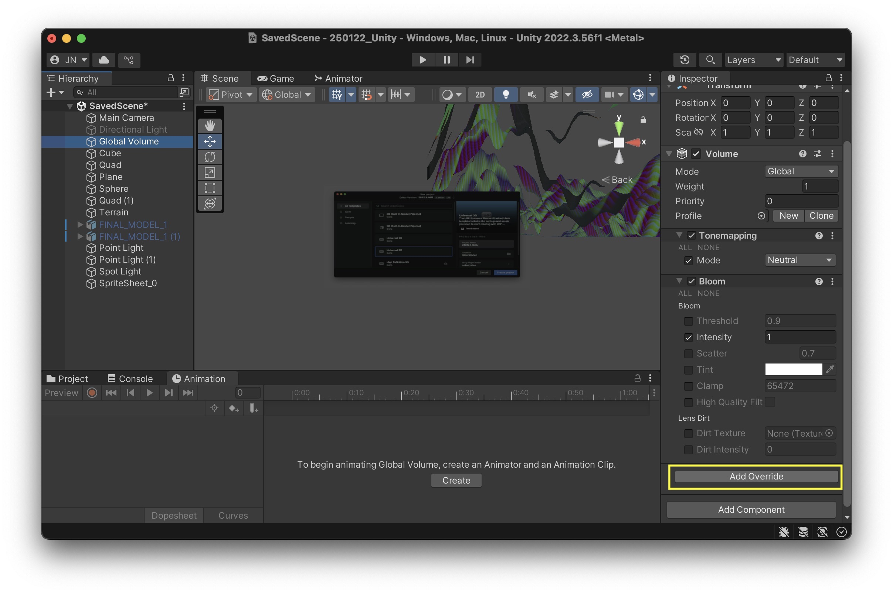

> If you don't have a Global Volume Game Object in your scene you can add it when you go to: GameObject -> Volume -> Global Volume

Some of the effects are: 
- Chromatic Aberration – Simulates lens distortion by slightly separating colors, creating a fringing effect often seen in real-world camera lenses.
- Color Adjustments – Allows control over brightness, contrast, saturation, and hue to fine-tune the overall color balance of the scene.
- Depth of Field – Blurs objects based on their distance from the camera, mimicking how real cameras focus on specific areas.
- Film Grain – Adds a subtle grainy texture to simulate the look of old film cameras, enhancing a cinematic feel.
- Lens Distortion – Warps the edges of the image to mimic real-life lens imperfections, often used to create a fisheye or wide-angle effect.
- Lift, Gamma, Gain – Provides fine control over color grading by adjusting shadows (lift), midtones (gamma), and highlights (gain).
- Motion Blur – Blurs objects based on their speed and direction, creating a smoother, more dynamic look for fast movements.
- Shadows, Midtones, Highlights – Separately adjusts the brightness and color of different tonal ranges, offering advanced control over lighting and contrast.

> You can find a detailled Tutorial here: [POST PROCESSING in URP (Universal Render Pipeline)](https://www.youtube.com/watch?v=oXNy9mszKxw)

# Audio 

To add sound to a scene create a new Audio Source: GameObject -> Audio -> Audio Source. Or drag and drop your soundfile in the Sceneview. 
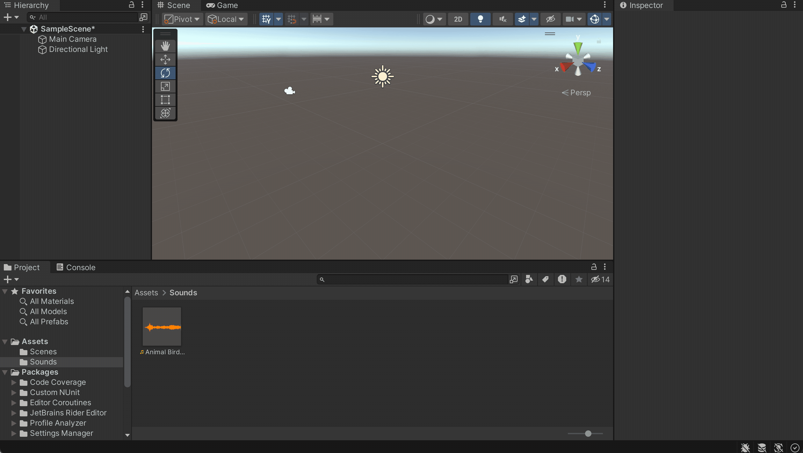

Supported file formats: 
- AIFF 
- WAV 
- MP3
- Ogg 

Places to get (free) sounds: 
- [Adobe Creative Cloud](https://www.adobe.com/products/audition/offers/AdobeAuditionDLCSFX.html)
- [Unity Asset Store](https://assetstore.unity.com/?category=audio&free=true&orderBy=1)
- [freesounds.org](https://freesound.org/people/Nox_Sound/)
- [OpenGameArt](https://opengameart.org/art-search-advanced?field_art_type_tid%5B%5D=13)
- [Soundcloud](https://soundcloud.com/)

> - [Tutorial: Sound Component in Unity](https://learn.unity.com/tutorial/working-with-audio-components-2019-3)

## Spatial Audio

Spatial audio in Unity simulates how sounds change based on their position relative to the listener, creating a more immersive experience. It takes into account distance, direction, and environmental effects to make sounds feel like they are coming from specific locations in 3D space.

### Audio Listener & Audio Sources

- The Audio Listener component, usually attached to the Main Camera, represents the player's "ears" and determines how sound is perceived in the scene. Only one Audio Listener should be active at a time.
- Audio Sources are attached to GameObjects that produce sound. They determine volume, pitch, spatial blend, and 3D positioning of the audio.
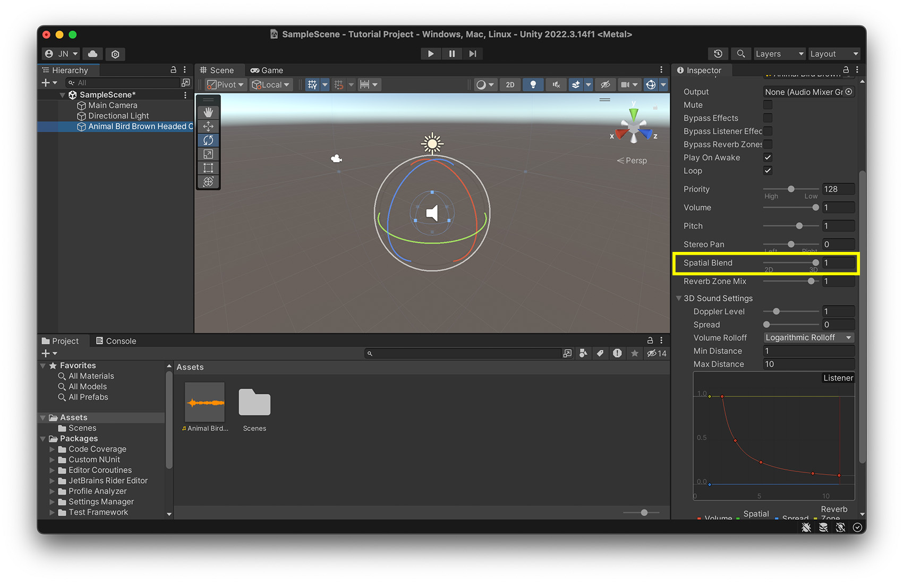

With "Min Distance" and "Max Distance" you can set the minimum and maximum distance of audibility. 
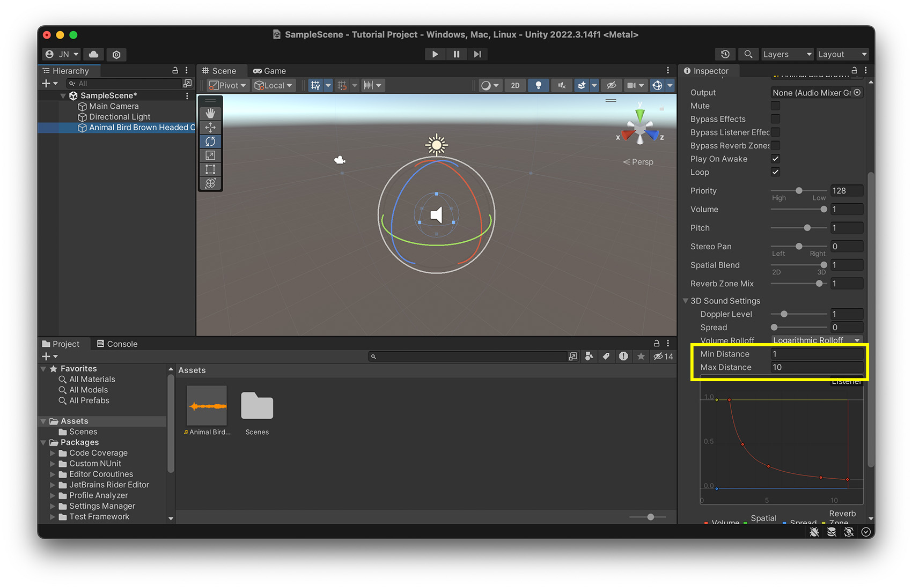

With the "Volume Rolloff" you can select different Rolloff algorithms. Select "Linear Rolloff" if you want to hear a strong difference based on the positioning, "Logarithmic Rolloff" for a more realistic effect. 
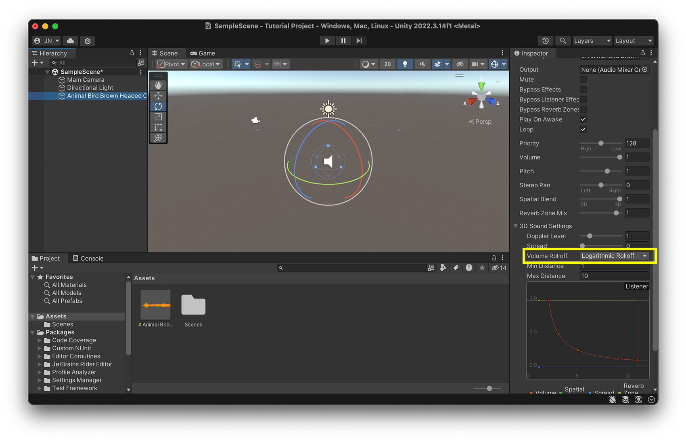

