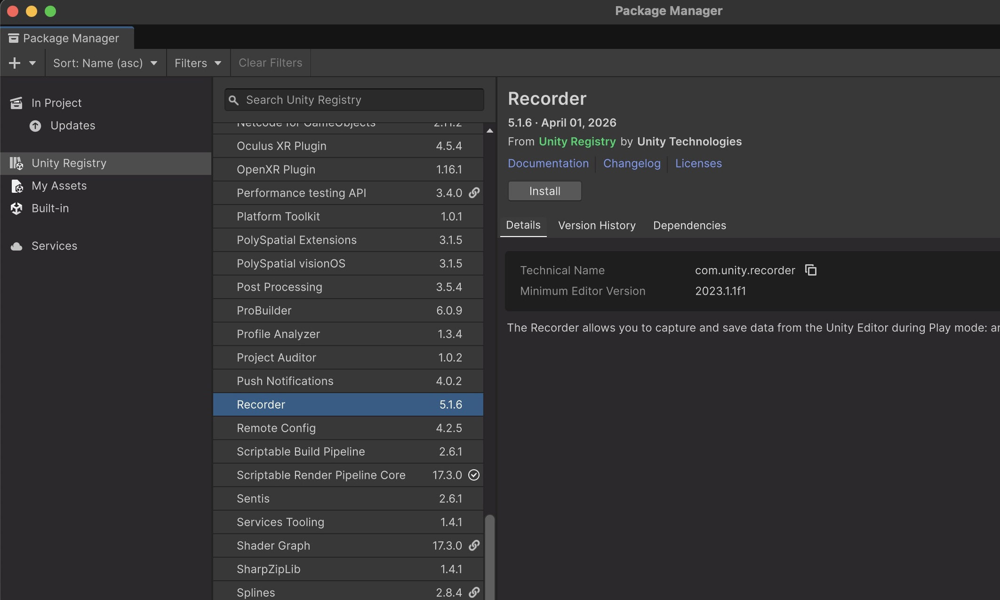
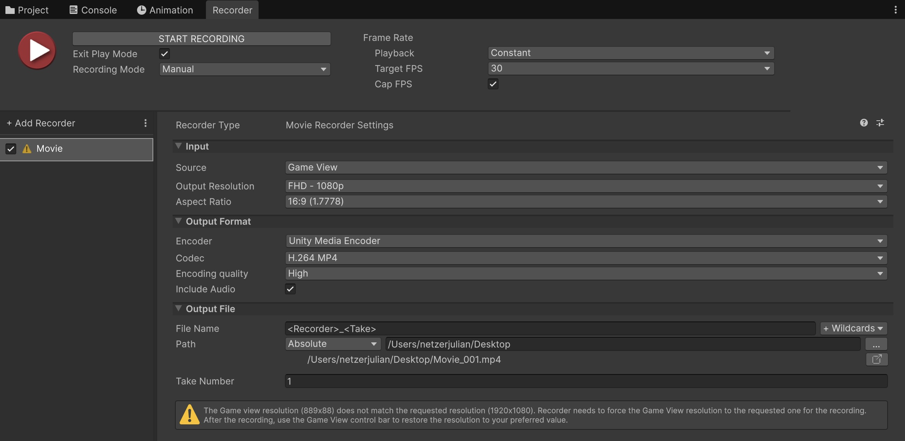

# Recording 

##  Install Recorder
- In the top menu go to: Window → Package Manager
- In the Package Manager: Click the dropdown at the top left and select "Unity Registry". 
- Search for "Recorder".
- Select Unity Recorder from the list and click "Install".

## Record 
- Once installed, go to: Window → General → Recorder → Recorder Window
- The Recorder Window will open, where you can set up your recording.

- In the Recorder Window, click the “+ Add New Recorder” button. Choose the recording type: Movie.

- I would recommend these settings: 

- Make sure that the movie file gets saved outside your Unity folder! 

- When you now click the Play Button in the Recorder Window Unity will record your scene. 

>You can also change the Recording Mode: 
>   - Manual: Start and stop recording manually.
>   - Frame Interval: Record from specific frames (e.g., frames 0–300).
>   - Time Interval: Record for a set time (e.g., 10 seconds).