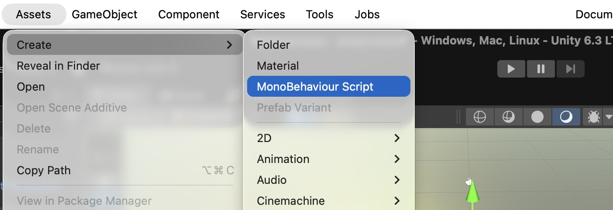
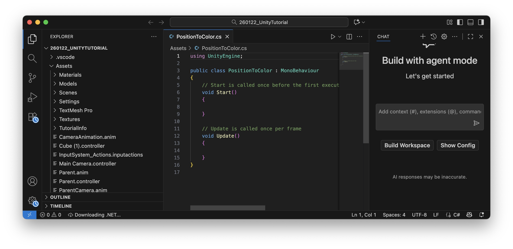
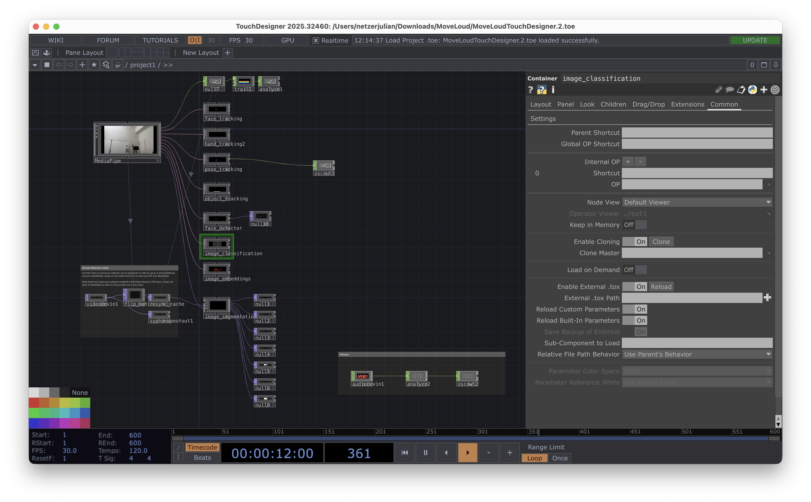

# <a name="Coding"></a>Coding in Unity 

In Unity, scripts with the programming language C# are used to control the behavior of GameObjects. Scripts interact with objects by modifying their properties, responding to player input, or handling game logic. Each script is typically attached to a GameObject as a component, allowing it to influence that object.

A script is a asset saved as a .cs-File 

A basic Unity script looks like this:
```
using UnityEngine; //imports whats needed for the script to run, in this case the basic Unity Engine

public class ExampleScript : MonoBehaviour //Name of the Script (must be the same as the filename)
{
    void Start()
    {
        // Runs once when the GameObject is first activated
    }

    void Update()
    {
        // Runs every frame, useful for movement or checking inputs
    }
}
```

> when you write // in your code you can write comments afterwards, this is useful to explain this, or to remember what certain code blocks are for

## Functions

A function (also called a method) in Unity is a block of code that performs a specific task. Functions help organize code, making it reusable and easier to manage. In Unity, functions are often used to control GameObjects, handle player input, or execute game logic.
Structure of a Function

A function in C# consists of:
- Return Type – Defines what the function returns (e.g., void for no return, int for numbers).
- Function Name – The identifier used to call the function.
- Parameters (Optional) – Data passed into the function.
- Code Block – The actual instructions inside { }.

Example:
```
void Start()
    {
        Debug.Log("Hello World");// Runs once when the GameObject is first activated, this writes "Hello World" in the console.
    }
```

## Variables

Variables are like storage boxes that hold data (values).

- int – Stores whole numbers (e.g., int score = 10;).
- float – Stores decimal numbers (e.g., float speed = 5.5f;).
- bool – Stores true or false (e.g., bool isJumping = false;).
- string – Stores text (e.g., string playerName = "Alex";).
- GameObject / Transform / Rigidbody – Stores references to Unity objects.

## Control Structures 

### Conditionals

These allow the program to make decisions. 

Example:
```
if (health < 20) {
    Debug.Log("Warning: Low health!");
} else {
    Debug.Log("Health is good.");
}
```

## Examples how scripts interact with GameObjects

#### Access Components – Scripts can modify an object's Transform, Audio Source, Rigidbody, Collider, or any other component.
```
GetComponent<AudioSource>().volume = 0;
```

#### Modify Object Properties – Change position, scale, color, or any other attribute.
```
transform.position = new Vector3(0, 2, 0);
```
#### Handle Player Input – Detect key presses, mouse clicks, or controller inputs.
```
    if (Input.GetKeyDown(KeyCode.Space))
    {
        Debug.Log("Jump!");
    }
```

## <a name="newscript"></a>Creating a new script

To create a script select Assets -> Create -> Mono Behaviour Script and select a name (please use a name that describes the function in our case "PositionColorMapper"). 


Then double click on the script in the project window, this should open Visual Studio Code with the script opened: 


Now we can copy & paste our code: 
```
using UnityEngine;

[RequireComponent(typeof(Renderer))]
public class PositionColorMapper : MonoBehaviour
{
    void Update()
    {
        Vector3 pos = transform.position;
        float h = Mathf.InverseLerp(-10f, 10f, pos.x);
        float s = Mathf.InverseLerp(-10f, 10f, pos.y);
        float v = Mathf.InverseLerp(-10f, 10f, pos.z);
        GetComponent<Renderer>().material.color = Color.HSVToRGB(h, s, v);
    }
}
```

In Unity, a script needs to be attached to a GameObject to function properly because of how Unity’s architecture is designed. Unity follows a component-based architecture, where behaviors and properties are added to GameObjects through components—and scripts are one of those components.

So we will create a Cube, that will change the color based on its position in space. Make sure that the cubes position is at 0/0/0

When we created the GameObject we can either drag and drop our script on the GameObject or we can select the GameObject and click on "Add Component" and search for our "Position Color Mapper"-Script.

Then we can start the Play Mode and when you move your Cube around it should change its color.


# <a name="llm"></a>Working with ChatGPT & Claude

In the next step we want to change our existing script with the LLMs (Large Language Models) ChatGPT (https://chatgpt.com) or Claude (https://claude.ai). 
So please first sign up for one of the tools.  

The first exercise is to change the script so we can edit values directly in the Unity Editor — without touching the code.

To make a variable visible and editable in the Inspector, declare it as public:
```
float speed = 5f;
```

Public variables appear automatically in the Inspector, so you can tweak them per object without editing the script.

Try it: Ask the LLM to make the min/max range values in PositionColorMapper editable in the Inspector.

## Best practices

### Be precise
Describe the Problem:
Clearly explain what you’re trying to achieve. Include details like the programming language (e.g., C#), the framework (e.g., Unity, if needed also the Unity version), and any specific constraints.

Provide Context:
If you’re working on a script for Unity, mention details like the GameObject, the components involved (like Rigidbody, Collider), or what’s already implemented.

### Ask how to use the script in Unity

You can also ask how you should use the script in your unity scene, so which GameObject do you need to create or which component you have to add. 

### Use Iterative Development

Start Simple:
Ask for basic functionality first. Once that’s working, request more complex features.

Refine the Code:
If the code doesn’t work as expected, describe the error or unexpected behavior. The LLM can help you debug by suggesting fixes. You can for example copy and the paste the output of the console into the LLM. 

### Ask for Explanations, Not Just Code

Understanding the code helps you debug and modify it later.

Request Explanations:
“Explain what this line of code does. Comment every line of code"
“Why do we need GetComponent<Rigidbody>() here?”

Improve Your Skills:
Use the LLM as a tutor, not just a code generator.

### Save Useful Prompts

Keep a list of prompts that worked well for you. This helps you quickly reuse effective questions without starting from scratch.

# Implementing Voice & Pose Control 

To analyze the volume of a voice or microphone input in real time, we use TouchDesigner — a node-based visual programming environment often used for interactive installations, live visuals, and data-driven experiences. Instead of writing low-level audio analysis code, TouchDesigner lets us wire together audio nodes to extract values like volume or pitch in just a few clicks.

We then send these values to Unity via OSC (Open Sound Control) — a lightweight network protocol designed for real-time communication between creative software. TouchDesigner acts as the sender, Unity as the receiver, allowing us to drive any parameter in our scene directly from live audio input.

## Installing Touchdesigner 

First install Touchdesigner from here: https://derivative.ca/download

An register yourself with a non-commercial account. 

Then download the Touchdesigner-File: [Touchdesigner-File](https://juliannetzer.de/downloads/MoveLoudTD.zip)

Unzip the file and open the MoveLoudTouchDesigner.toe-file.

This should open Touchdesigner like this: 


Once running, the program analyzes your pose and loudness in real time and sends the data to Unity via OSC.

## Installing extOSC in Unity 

Now, we need to receive the OSC-Data in Unity for this we need the extOSC Plugin, please install it from here: 
[extOSC-Plugin](https://assetstore.unity.com/packages/tools/input-management/extosc-open-sound-control-72005?srsltid=AfmBOoqOfEArUB0d02aMF7d1hlWT2QkEta6pDht8iwknMp-Nit1UKDcE)

This plugin handles incoming OSC messages and makes them accessible in your scripts.

## Using Sound Data in our Scene 

### Moving a Cube with Sound

Download the following package: [Download Scripts](https://juliannetzer.de/downloads/ScriptsVolumeUnity.zip)

Place the scripts into your Unity project — create a Scripts folder if you don't have one yet.

1. Create a new empty GameObject and attach the OSCVolumeReceiver.cs script to it.

2. Create a new Cube GameObject, make sure it's visible to the camera, and attach the VolumeMover.cs script to it.

3. Hit Play — the cube should move upward when the volume exceeds a certain threshold.

You can adjust the Threshold and Max Height values directly in the Inspector on the VolumeMover script.

> How it works: OSCVolumeReceiver registers an OSC listener on a specific port and updates a public static volume float whenever a new message arrives. VolumeMover reads that value in Update() and translates it into vertical movement — no direct reference between the scripts needed.

> Bonus: Try the VolumeJump script on your First or Third Person Controller — your character will jump when you're loud enough.

Try it yourself: Experiment with controlling other elements in your scene! Use the VolumeScaler.cs script as a reference — paste it into the LLM and ask it to modify the behavior to fit your needs. For example: change an object's color, rotation, or material based on the volume.