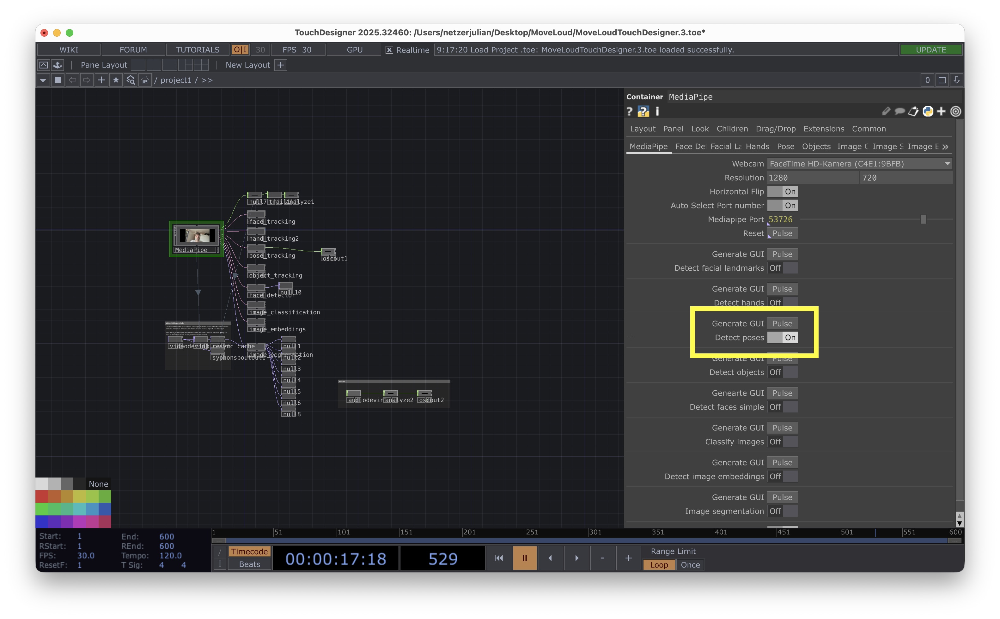
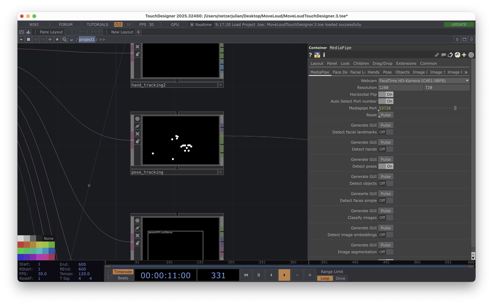
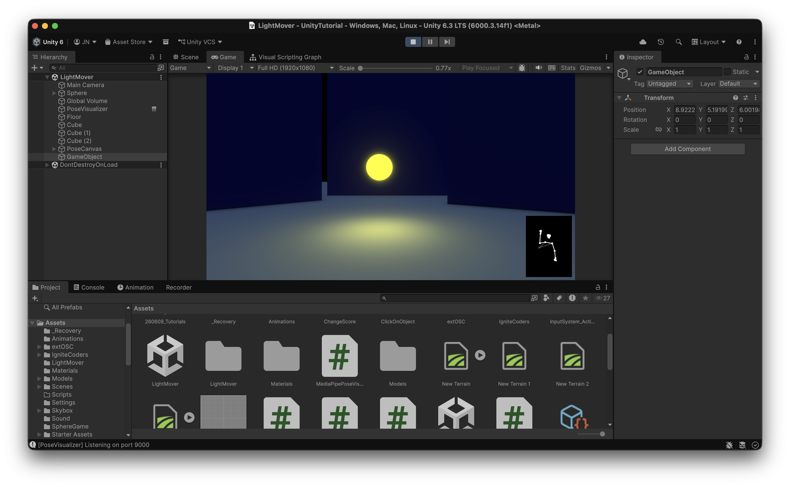
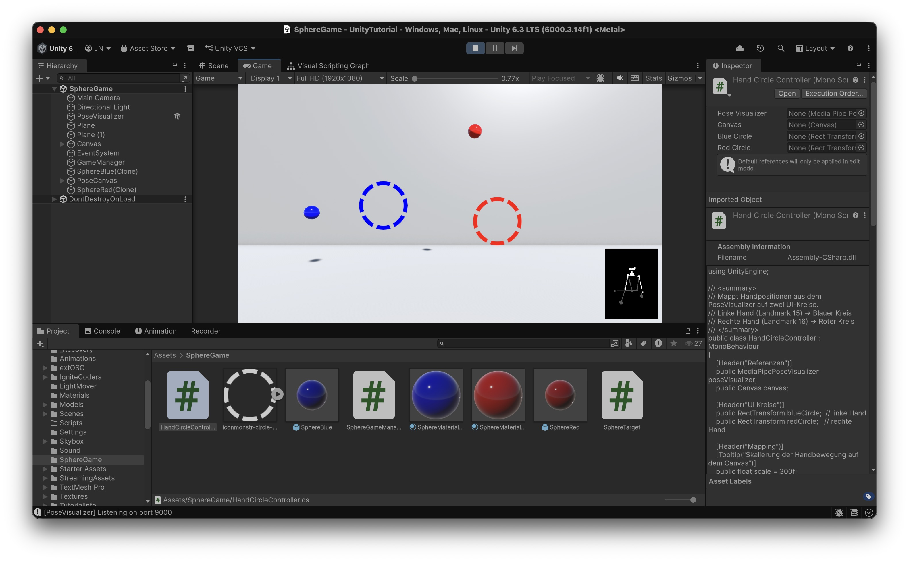

# <a name="Coding"></a>Pose Tracking 


## Configuring Touchdesigner 

To make the Pose Tracking work, first make sure that the Touchdesigner file from Session 6 is open and running. Then click on the media pipe node and turn on the pose tracking: 


Now you should see in the Pose Tracking node that your Pose is being tracked: 


# Installing the Light Mover Example



1. Download the following file: [Example Scenes](https://juliannetzer.de/downloads/260615_PoseExamples.zip)

2. Start Unity with the project from Session 6. Extract the zip-file and double click on the LightMover.unitypackage-file, this should open Unity with an Import Dialog. Select everything and click on import. 

3. Click on the LightMover Scene in the Unity Project Window, this should open the example Scene. 

## Understanding the example scene

The scene has two key GameObjects:

- *PoseVisualizer* runs MediaPipePoseVisualizer.cs, which receives body tracking data from MediaPipe via OSC and displays a live skeleton overlay in the corner of the screen.

- *Sphere* runs ArmGestureController.cs, which reads the pose data and moves the sphere based on arm gestures — when both arms point in the same direction (left, right, up, or down), the sphere moves accordingly. Movement speed scales with how far the arms are stretched.

The two scripts are connected: ArmGestureController reads the landmark positions and visibility flags that MediaPipePoseVisualizer continuously updates from the OSC stream.

### MediaPipePoseVisualizer

The `MediaPipePoseVisualizer` is a general-purpose component for receiving and
visualizing MediaPipe pose tracking data in Unity via OSC. It is designed to be
the foundation for any project that uses body tracking — students can use it as
a starting point and build their own gesture logic on top of it.

It exposes two public arrays that other scripts can read:
- `Positions` — the 3D coordinates of all 33 body landmarks
- `ActiveLandmarks` — which landmarks are currently being received

**OSC Settings**
- `Port` — UDP port to receive MediaPipe data on (default: 9000)

**Window**
- `Window Size` — width/height of the skeleton overlay panel
- `Window Margin` — distance from the screen edge
- `Padding` — inner spacing around the skeleton

**Visualization**
- `Dot Size` — size of the joint dots
- `Bone Width` — thickness of the skeleton lines

**Visibility**
- `Visibility Threshold` — how confident MediaPipe must be before a landmark
  is shown (0–1); occluded landmarks fall back to their last known position
- `Occluded Color` — color used for joints and bones that are currently occluded

---

### ArmGestureController

The `ArmGestureController` is an example of how to build custom gesture logic
on top of the `MediaPipePoseVisualizer`. It shows the basic pattern you
should follow for your own projects:

1. Get a reference to the `MediaPipePoseVisualizer`
2. Check which landmarks are active using `ActiveLandmarks`
3. Read the relevant positions from `Positions`
4. Use the data to drive any behavior — movement, animation, interaction, etc.

In this example, the script reads the shoulder and wrist positions of both arms,
detects whether they point in the same direction, and moves the sphere accordingly.

**References**
- `Pose Visualizer` — drag the PoseVisualizer GameObject here (auto-detected if left empty)

**Movement**
- `Move Speed` — overall speed of the sphere

**Gesture Tuning**
- `Min Stretch` — minimum wrist-to-shoulder distance before a gesture is recognized;
  prevents accidental movement when arms are at rest
- `Direction Agreement` — how closely both arms must point in the same direction (0–1);
  lower values are more lenient, 0.3 is a good starting point
- `Smoothing` — how quickly the sphere reacts to gesture changes;
  higher values feel snappier, lower values feel floatier

## Task: Remix the Gesture Controller

Using the `ArmGestureController` as a starting point, create your own script
that uses the same arm gestures to control something other than position —
for example the sphere's size, color, or rotation.

**Steps**

1. Open `ArmGestureController.cs` in Visual Studio
2. Copy the entire script and paste it into a new file — name it something like
   `MyGestureController.cs` and rename the class accordingly
3. Copy the prompt below into ChatGPT or Claude and describe what you want to control:

> *"Here is a Unity C# script that moves a sphere based on arm gestures from
> MediaPipe pose data. Please modify it so that instead of moving the object,
> it controls [your idea, e.g. the scale / the color / the rotation].
> Keep the gesture logic the same."*
> 
> [paste your script here]

4. Paste the generated code back into Visual Studio and fix any errors with the
   AI's help if needed
5. Remove the `ArmGestureController` component from the Sphere and add your new
   script instead
6. Press Play and test it

**A note on the Sphere's structure**

The Sphere has a child GameObject that contains a Point Light — this is what
gives it the glowing appearance. If your remix changes the sphere's color, make
sure to update the light color as well, so both stay in sync. Note to your AI: You can do this
by getting a reference to the `Light` component in the child object:

```csharp
Light pointLight = GetComponentInChildren<Light>();
pointLight.color = yourColor;
```

**Ideas**
- Scale the sphere up/down based on stretch amount
- Shift the color along a gradient depending on direction

# Installing the Sphere Game Example



## Setup 

| GameObject | Description |
|---|---|
| Camera | The player's point of view into the 3D world |
| Canvas | The 2D overlay surface holding the hand circles |
| BlueCircle / RedCircle | Image elements on the Canvas that follow the player's hands |
| Sphere (Blue/Red) | 3D target objects the player needs to hit with their hand |
| GameManager | An invisible GameObject that controls spawning |
| PoseVisualizer | Receives MediaPipe hand/body data from TouchDesigner via OSC |
| HandCircleController | Reads hand positions and moves the UI circles |

> What is a Canvas? A Canvas is a special GameObject that acts as the drawing surface for all 2D UI elements. Anything that should appear as a flat overlay on the screen — buttons, images, text — must be placed inside a Canvas. In our game, the two hand-tracking circles are Image elements living inside a Canvas set to Screen Space Overlay, which means they always render on top of everything else, directly on the screen. 

> What is a Prefab? A Prefab is a saved template for a GameObject. Instead of placing every sphere by hand in the Scene, we define one sphere once (with its color, scripts, and settings), save it as a Prefab, and then the GameManager can create as many copies as needed at runtime. If you change the Prefab, all instances update automatically.

## The Flow 

You move your hand in front of the camera
        ↓
TouchDesigner tracks your body with MediaPipe
        ↓
Sends the positions as OSC data over the network
        ↓
PoseVisualizer receives and stores all joint positions
        ↓
HandCircleController reads the wrist positions
and moves the UI circles on screen
        ↓
SphereTarget checks every frame:
"Is my circle overlapping the sphere on screen?"
        ↓
Hold for 2 seconds → sphere turns white → disappears
        ↓
GameManager spawns a new sphere at a random position

## Task 

Use AI to walk through the scene scripts and understand how the spawning and hover detection work. Once you have a grasp of the logic, try remixing it: place the spheres manually in the scene instead of spawning them randomly, and require the player to hover over all of them in order to complete the task. This is a straightforward approach to building a gesture-driven follow or collect mechanic.
