# User Interfaces 

Unity's built-in UI system lets you build menus, HUDs, buttons, score displays, and any other on-screen elements your game needs. It (mostly) lives on top of your scene and always faces the camera — so no matter where the player moves, the UI stays put.
In this tutorial you will learn how to set up a UI canvas, add elements to it, and connect them to your game logic.

## Canvas

The Canvas is the root object for everything UI in Unity. Think of it as a blank sheet of paper placed in front of the camera — every button, text field, or image you create must live inside a Canvas to be visible on screen.

### Creating a Canvas
There are two ways to add a Canvas to your scene:

Via the menu: Go to GameObject → UI → Canvas in the top menu bar.
Via the Hierarchy panel: Right-click anywhere in the Hierarchy, then choose UI → Canvas.

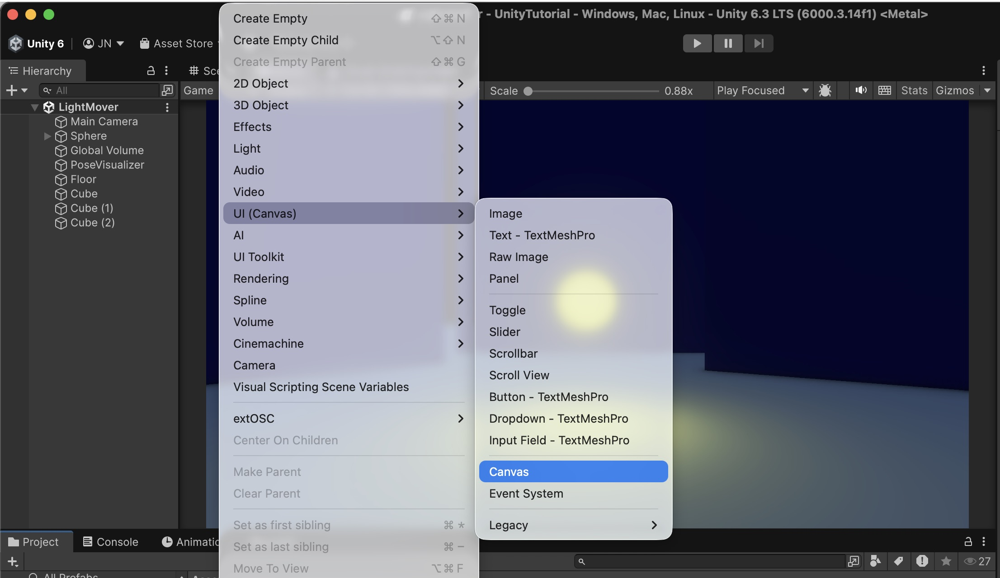

Unity will automatically add two objects to your Hierarchy:
- Canvas — the container for all your UI elements
- EventSystem — handles input like mouse clicks and keyboard navigation; Unity creates this automatically and you generally don't need to touch it

### Settings 

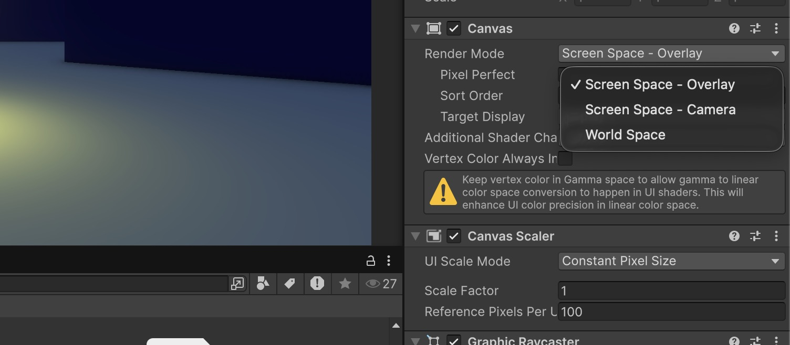

#### Render Mode
The Render Mode controls how and where the Canvas is rendered relative to your scene and camera. Click on the dropdown to choose between three options:
Screen Space – Overlay (default)

The Canvas is drawn directly on top of everything, independent of any camera. It always fills the screen and is always on top — ideal for standard HUDs and menus.
Screen Space – Camera

The Canvas is linked to a specific camera and rendered at a set distance from it. This allows post-processing effects and camera effects to apply to the UI as well.
World Space

The Canvas behaves like a regular 3D object in the scene. Useful for in-world UI elements like name tags, interactive screens, or diegetic displays.

> For beginners: Stick with Screen Space – Overlay. It is the simplest setup and works for most 2D UI needs.

#### Canvas Scaler 

The Canvas Scaler component controls how the UI scales across different screen sizes and resolutions.
Change UI Scale Mode from Constant Pixel Size to Scale With Screen Size — this is the recommended setting for almost every project.

You will now see a Reference Resolution field. Set it to the resolution you are designing for — 1920 × 1080 is a safe default for most games.
Unity will then scale all UI elements up or down proportionally, so your layout looks consistent across different screen sizes.

Screen Match Mode controls how Unity handles screens that don't match your reference ratio exactly. Leave it on Match Width Or Height with the slider in the middle (0.5) for now — this blends both axes and works well in most cases.

## Images 

The Image component is one of the most basic UI elements in Unity. It displays a sprite — a 2D graphic — on the Canvas. You can use it for backgrounds, icons, decorative frames, health bars, or any other visual element that doesn't need to be interactive on its own.

> Important: Always create UI elements as children of the Canvas — not at the root level of the Hierarchy. If an Image is not inside a Canvas, it will not be visible.

### Adding an Image
In the Hierarchy, right-click on your Canvas and choose UI → Image. Unity will place a white rectangle in the center of your Canvas.

In the Inspector you will see a Source Image field. Click the small circle icon next to it to open the asset picker and select your sprite.

The Material field directly below can stay empty — Unity uses a default UI material that works fine for all standard cases.
Color / Tint

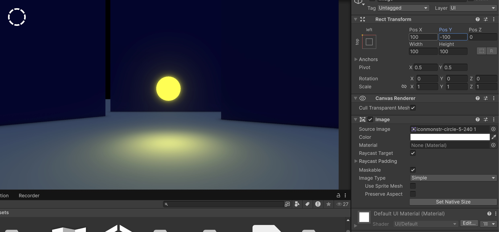

> If your sprite is white or light-colored, you don't need to import a separate colored version. Simply use the Color field to tint it — Unity multiplies the color with the sprite, so a white image can become any color you like. This is a handy way to reuse the same asset in different colors.

### Rect Tranform

Every UI element in Unity has a Rect Transform instead of a regular Transform. It works similarly — position, rotation, scale — but adds UI-specific properties for size and anchoring.

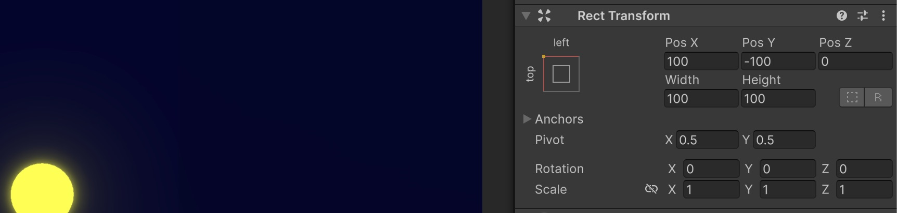

#### Position and Size

**Pos X / Pos Y** define the position of the element relative to its anchor point. **Pos Z** is almost always `0` for flat UI.

**Width** and **Height** set the size of the element in pixels — based on your reference resolution from the Canvas Scaler.

#### Pivot

The **Pivot** defines the element's own center point — the point it rotates and scales around, and from which Pos X/Y is measured. Values go from 0 to 1:

- `0.5 / 0.5` — center *(default)*
- `0 / 1` — top left
- `1 / 0` — bottom right

#### Anchors

Anchors define which point on the **parent** element this UI element is attached to. This is the key to responsive layouts — if an element is anchored to the bottom-right corner, it will stay there regardless of screen size.

The small widget on the left of the Rect Transform visualizes the current anchor preset. Click it to open a quick picker with common anchor positions.

> **Tip:** Always think about anchors before placing elements. An element anchored to the center will drift off-screen on smaller displays if it was designed for 1920×1080.

Click the small anchor widget in the top-left of the Rect Transform to open the **Anchor Presets** picker.

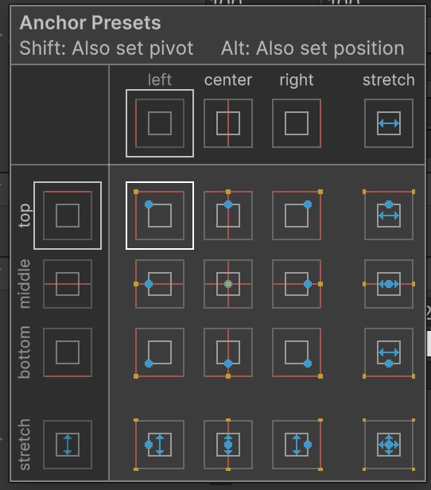

The grid lets you choose where the element is attached to its parent — both horizontally (left, center, right, stretch) and vertically (top, middle, bottom, stretch).

The **orange dot** in each preset icon shows the position of the anchor point relative to the parent.

**Common presets:**

- `top / left` — fixed to the top-left corner
- `middle / center` — centered on the parent *(default)*
- `bottom / right` — fixed to the bottom-right corner
- `stretch` — the element stretches to fill the parent's width or height

> **Tip:** For most fixed UI elements like a score display or a button, pick the corner or edge closest to where the element actually sits on screen. A top-left HUD element should be anchored top-left — that way it stays in place on any resolution.

# Text 

## Custom Fonts with TextMeshPro

Unity's default text system is **TextMeshPro (TMP)** — it produces sharper, more flexible text than the old Unity UI Text component. To use a custom font, you first need to convert it into a **TMP Font Asset**.

Please download [Basteleur designed by Keussel](https://velvetyne.fr/fonts/basteleur/) as an example. 

### 1. Import the Font

Drop your `.ttf` or `.otf` font file into your project's `Assets` folder.

> **Tip:**usually .ttf works better with Unity

### 2. Create a Font Asset

Right-click the font file in the Project panel and choose **Create → TextMeshPro → Font Asset → SDF**. Unity generates a new `.asset` file next to your font.

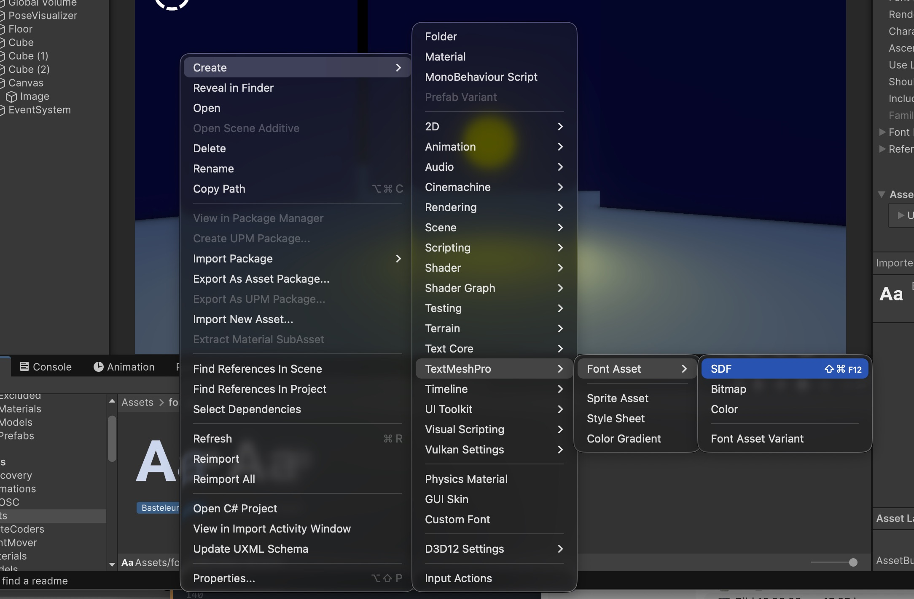

### 3. Create and assing the Font Asset

Now select your Canvas Element and click on **GameObject → UI (Canvas) → Text- TextMeshPro**.

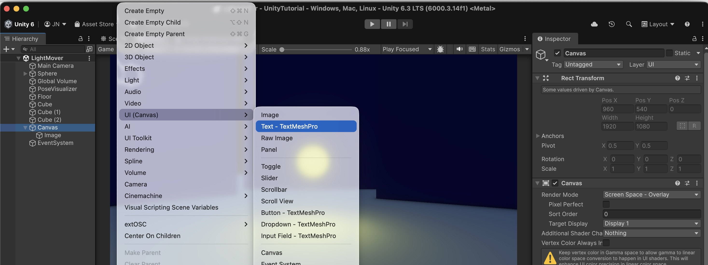

Now you should see your created Text, now you can assing your Font Assets in the Inspector, and also change settings like size, color, etc.: 
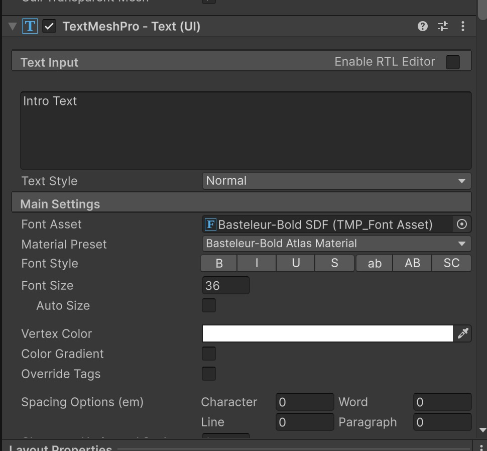

> **Tip:** Store all your Font Assets in a dedicated `Fonts` folder inside `Assets` to keep your project tidy.

# Buttons

A **Button** is one of the most essential interactive UI elements in Unity. It detects user clicks and triggers a response — opening a menu, starting the game, or any other action you connect to it.

## Adding a Button

In the Hierarchy, right-click your **Canvas** and choose **UI (Canvas) → Button - TextMeshPro**. Unity creates a Button object with a TMP text child automatically.

## Structure

A Button in Unity consists of two parts:

- **Button object** — carries the Image component (the visual background) and the Button component (the interaction logic)
- **Text (TMP) child** — the label displayed on the button

You can style both independently — resize the background, change the font, adjust colors.

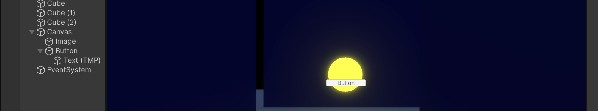

## Loading a New Scene with a Button

### 1. Download the Script

[Download](https://juliannetzer.de/downloads/SceneLoader.cs) the `SceneLoader.cs` script and place it into your project's `Assets/Scripts` folder.

### 2. Create a GameManager Object

In the Hierarchy, right-click an empty area and choose **Create Empty**. Rename the new object to `GameManager`.

### 3. Attach the Script

Drag `SceneLoader.cs` from the Project panel onto the **GameManager** object in the Hierarchy — or click **Add Component** in the Inspector and search for `SceneLoader`.

### 4. Add the Target Scene to the Build Profile

Before the scene transition can work at runtime, Unity needs to know about all scenes in your project.

Go to **File → Build Profile**. Drag your target scene from the Project panel into the **Scene List**. Make sure it appears in the list with a checkmark.

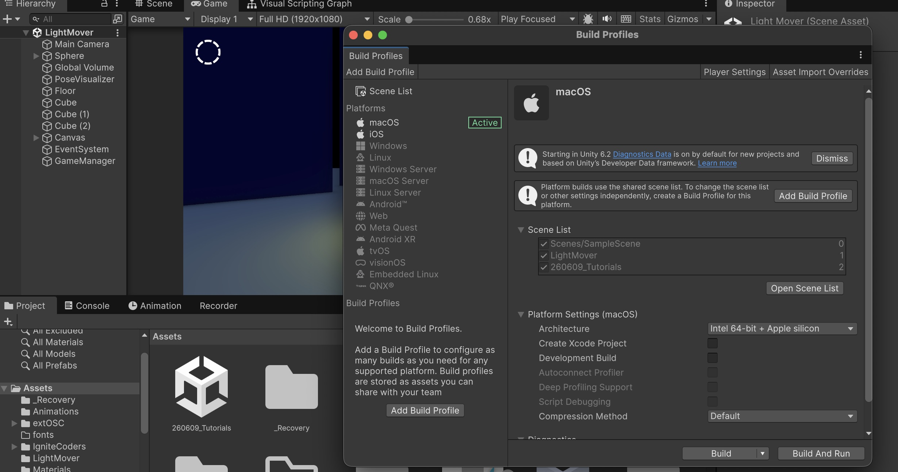

### 5. Connect the Button

Select your Button in the Hierarchy. In the Inspector, scroll down to the **On Click ()** section and click the **+** icon to add a new entry.

Drag the **GameManager** object from the Hierarchy into the empty object slot.

Click the dropdown that says *No Function* and select **SceneLoader → LoadScene (string)**.

A text field will appear — type in the exact name of your target scene.

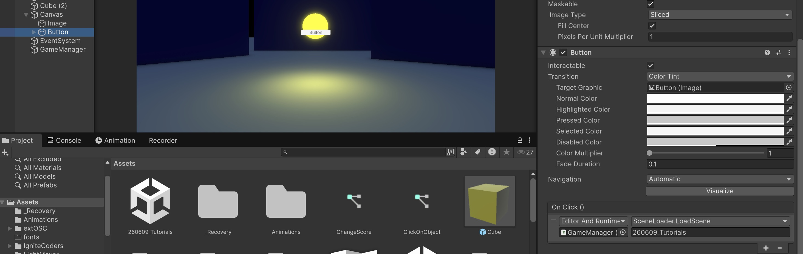

### 6. Test it

Press **Play** and click the button — Unity will load the target scene.

> **Tip:** The scene name in the On Click () field must match the filename of the scene exactly, without the `.unity` extension — for example `MainMenu`, not `MainMenu.unity`.

